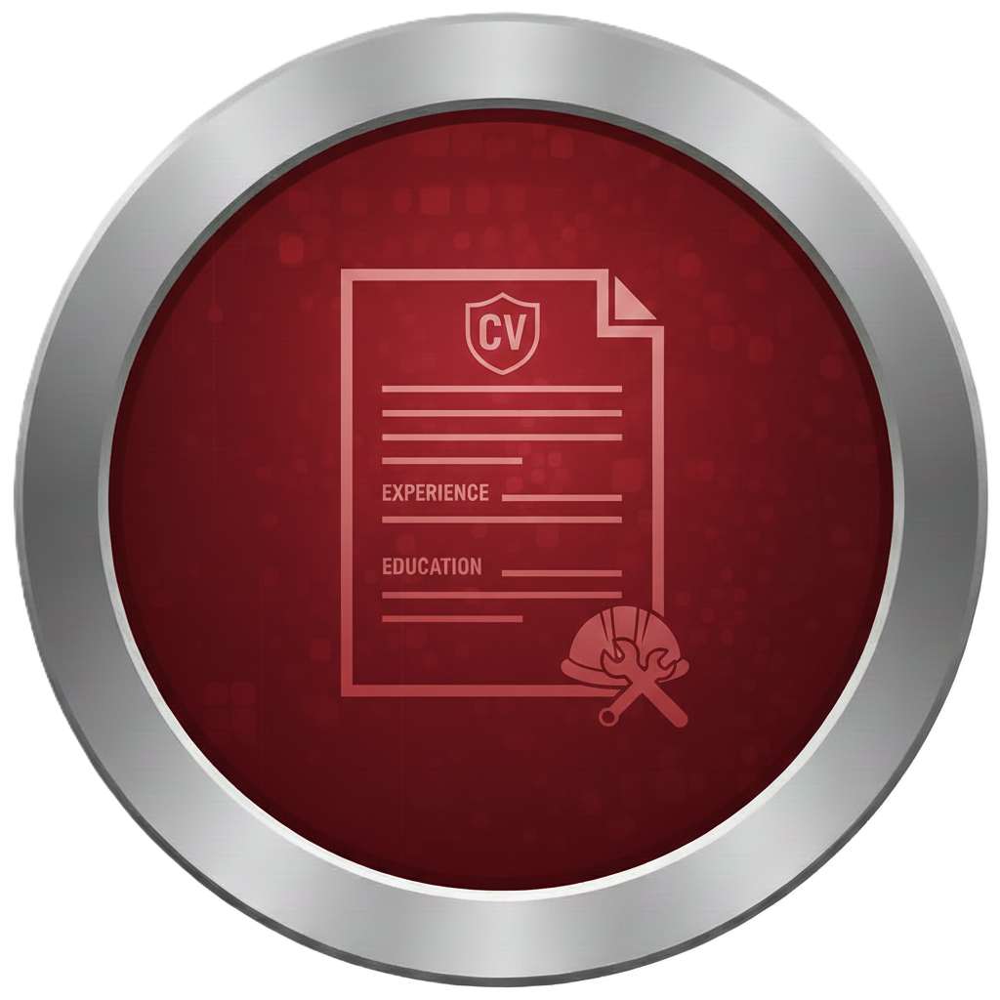

<!DOCTYPE html>
<html lang="es">
<head>
    <meta charset="UTF-8">
    <title>Perfil Profesional | Ingeniería</title>
    
</head>
<body>
    

        <h1>CENTRO DE OPERACIONES PROFESIONAL</h1>
        
Especialista en Acero y Concreto

        

            <a href="steel.html" class="menu-item">
                

                    
                

                
STEEL

            </a>

            <a href="concrete.html" class="menu-item">
                

                    
                

                
CONCRETE

            </a>

            <a href="./assets/docs/mi-cv.pdf" class="menu-item">
                

                    
                

                
MI CV

            </a>
        

    

</body>
</html>
