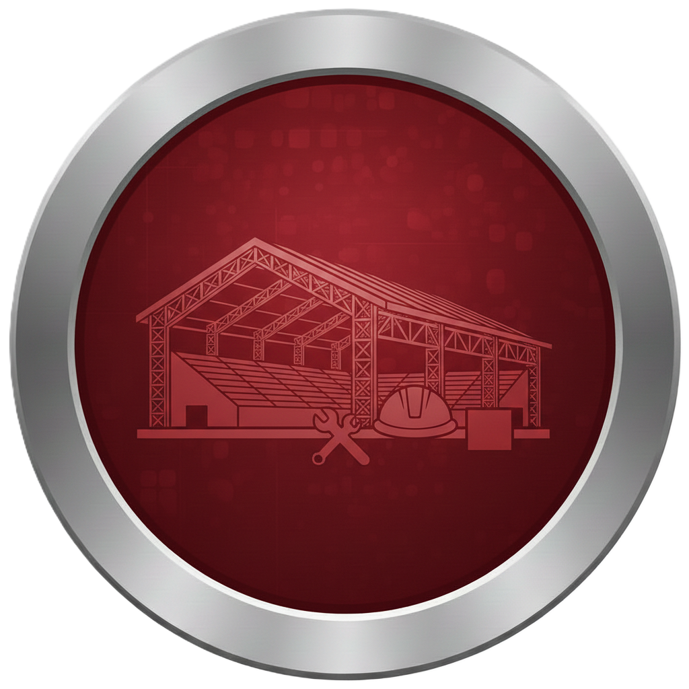
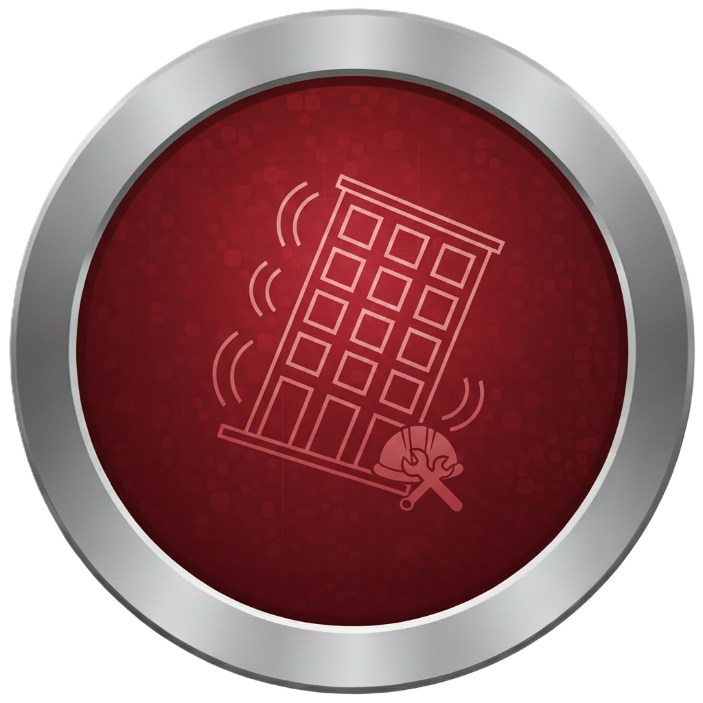
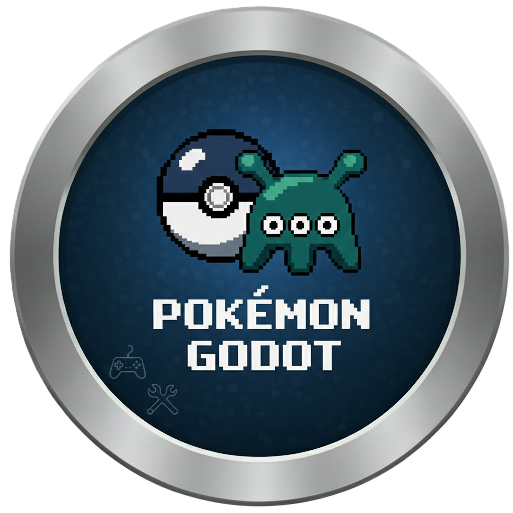
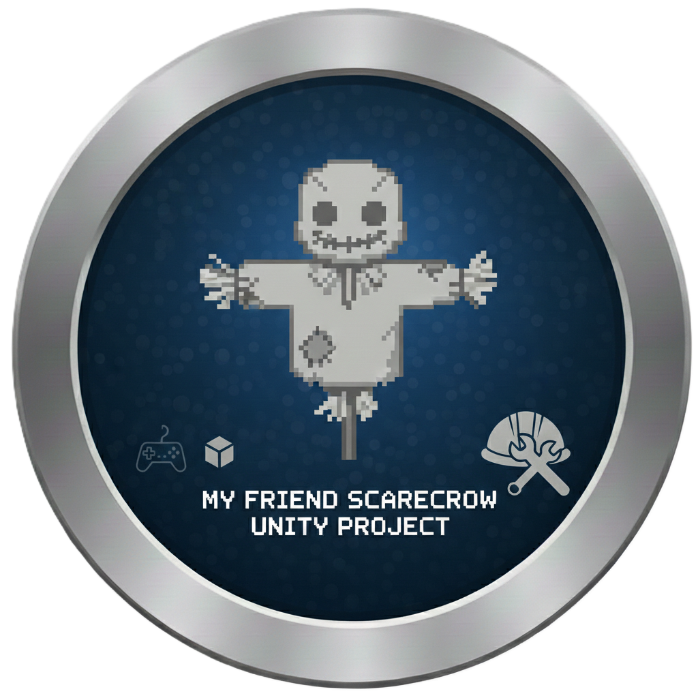
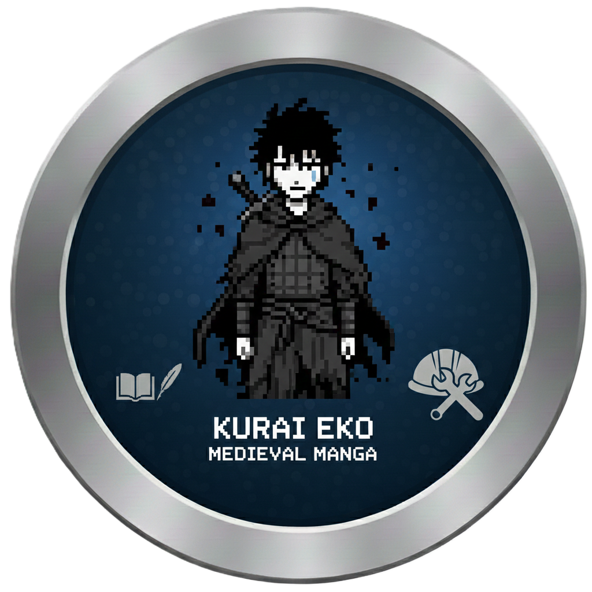

<!DOCTYPE html>
<html lang="es">
<head>
    <meta charset="UTF-8">
    <meta name="viewport" content="width=device-width, initial-scale=1.0">
    <title>Ing. Estructural & Developer | Portafolio Profesional</title>
    
    <!-- Font Awesome para iconos -->
    <link rel="stylesheet" href="https://cdnjs.cloudflare.com/ajax/libs/font-awesome/6.0.0/css/all.min.css">
</head>
<body>
    

    
    

        <header class="header">
            

                

                    
IE

                    

                        <h1>Ingeniero Estructural</h1>
                        
+ Developer

                    

                

                

                    <a href="mailto:tu-correo@gmail.com"><i class="fas fa-envelope"></i> Email</a>
                    <a href="https://linkedin.com/in/tu-perfil" target="_blank"><i class="fab fa-linkedin"></i> LinkedIn</a>
                    <a href="https://wa.me/tu-numero" target="_blank"><i class="fab fa-whatsapp"></i> WhatsApp</a>
                    <a href="https://github.com/tu-usuario" target="_blank"><i class="fab fa-github"></i> GitHub</a>
                

            

        </header>

        <section class="hero">
            <h2><strong>Estructuras</strong> que inspiran · <strong>Código</strong> que transforma</h2>
            
Ingeniero Civil Estructural · Desarrollador de Videojuegos · Investigador

            <a href="#" class="btn-info" onclick="alert('Sección de Información Personal (próximamente)'); return false;">
                <i class="fas fa-user"></i> INFORMACIÓN PERSONAL
            </a>
        </section>

        <main class="main-content">
            <!-- ÍNDICE DE NAVEGACIÓN -->
            

                <a href="#civil" class="index-link"><i class="fas fa-hard-hat"></i> Ing. Civil</a>
                <a href="#gamedev" class="index-link"><i class="fas fa-gamepad"></i> Game Dev</a>
                <a href="#research" class="index-link"><i class="fas fa-flask"></i> Investigación</a>
            

            <!-- Proyectos Ingeniería Civil -->
            <section id="civil" class="section">
                <h2 class="section-title">Proyectos de Ingeniería Civil</h2>
                

                    <a href="steel.html" class="project-card">
                        

                            
                        

                        

                            <h3>STEEL</h3>
                            
Diseño y análisis de estructuras metálicas complejas

                            

                                AISC
                                FEA
                                3D Modeling
                            

                        

                    </a>

                    <a href="concrete.html" class="project-card">
                        

                            
                        

                        

                            <h3>CONCRETE</h3>
                            
Estructuras de hormigón armado y pretensado

                            

                                ACI 318
                                ETABS
                                SAFE
                            

                        

                    </a>

                    <a href="seismic.html" class="project-card">
                        

                            
                        

                        

                            <h3>SEISMIC</h3>
                            
Análisis sísmico avanzado y diseño por desempeño

                            

                                Pushover
                                Time History
                                FEMA P-58
                            

                        

                    </a>
                

            </section>

            <!-- Proyectos Game Development -->
            <section id="gamedev" class="section">
                <h2 class="section-title">Game Development & Otros</h2>
                

                    <a href="pokemon.html" class="project-card">
                        

                            
                        

                        

                            <h3>POKEMON GODOT</h3>
                            
Fan game desarrollado en Godot Engine con mecánicas clásicas

                            

                                Godot
                                GDScript
                                RPG
                            

                        

                    </a>

                    <a href="friends.html" class="project-card">
                        

                            
                        

                        

                            <h3>MY FRIENDS</h3>
                            
Red social temática para comunidades de ingeniería

                            

                                React
                                Node.js
                                MongoDB
                            

                        

                    </a>

                    <a href="kurai.html" class="project-card">
                        

                            
                        

                        

                            <h3>KURAI EKO</h3>
                            
Videojuego indie de plataformas con temática ambiental

                            

                                Unity
                                C#
                                2D Art
                            

                        

                    </a>
                

            </section>

            <!-- Investigación Académica -->
            <section id="research" class="section">
                <h2 class="section-title">Investigación Académica</h2>
                

                    <a href="nanosteel.html" class="project-card">
                        

                            
                        

                        

                            <h3>NANOSTEEL</h3>
                            
Materiales nanoestructurados para aplicaciones estructurales

                            

                                Nanotecnología
                                Metalurgia
                                Publicación Q1
                            

                        

                    </a>

                    <a href="ecoconcreto.html" class="project-card">
                        

                            
                        

                        

                            <h3>ECOCONCRETO</h3>
                            
Hormigones ecológicos con materiales reciclados

                            

                                Sostenibilidad
                                Materiales
                                Durabilidad
                            

                        

                    </a>
                

            </section>
        </main>

        <!-- Footer ANCLADO (sticky) -->
        <footer class="footer">
            

                <a href="mailto:tu-correo@gmail.com"><i class="fas fa-envelope"></i> tu-correo@gmail.com</a>
                <a href="https://linkedin.com/in/tu-perfil" target="_blank"><i class="fab fa-linkedin"></i> LinkedIn</a>
                <a href="https://wa.me/tu-numero" target="_blank"><i class="fab fa-whatsapp"></i> WhatsApp</a>
                <a href="https://github.com/tu-usuario" target="_blank"><i class="fab fa-github"></i> GitHub</a>
                <a href="https://t.me/tu-usuario" target="_blank"><i class="fab fa-telegram"></i> Telegram</a>
            

            
© 2026 Ingeniero Estructural & Developer · Todos los derechos reservados

        </footer>
    

</body>
</html>
